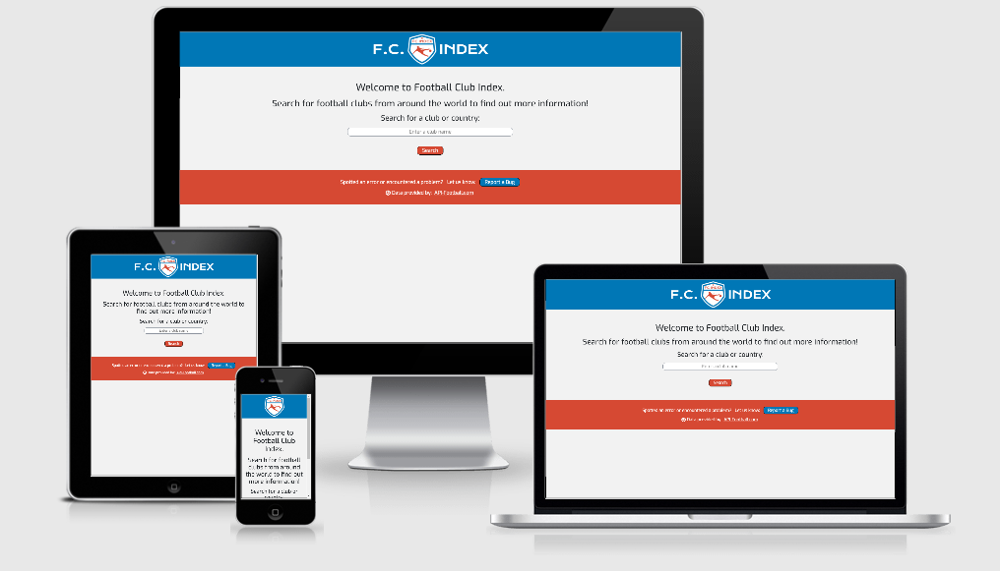
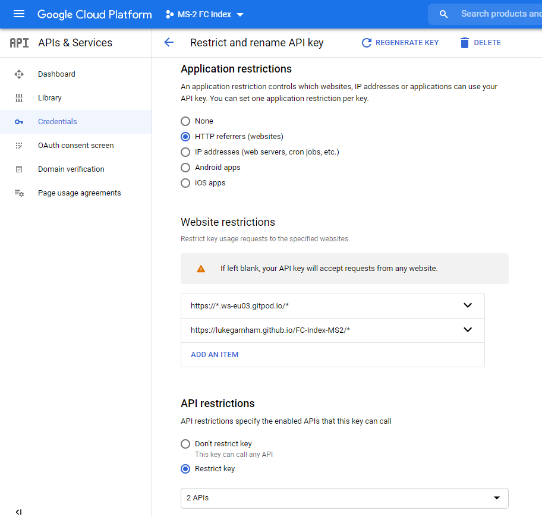
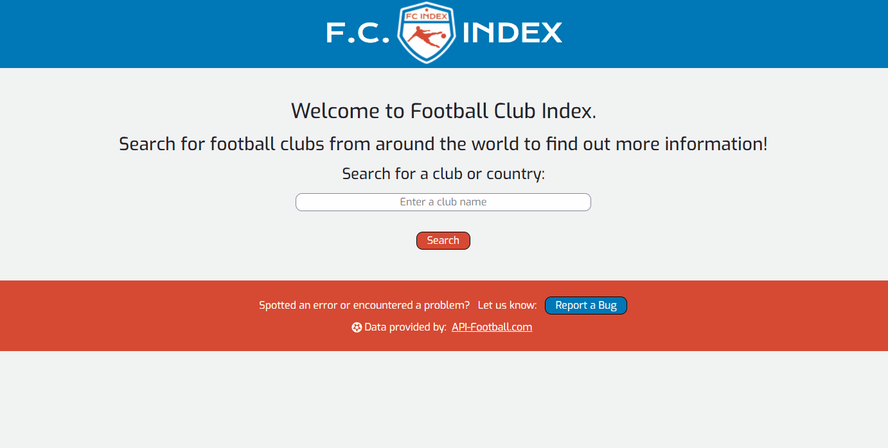
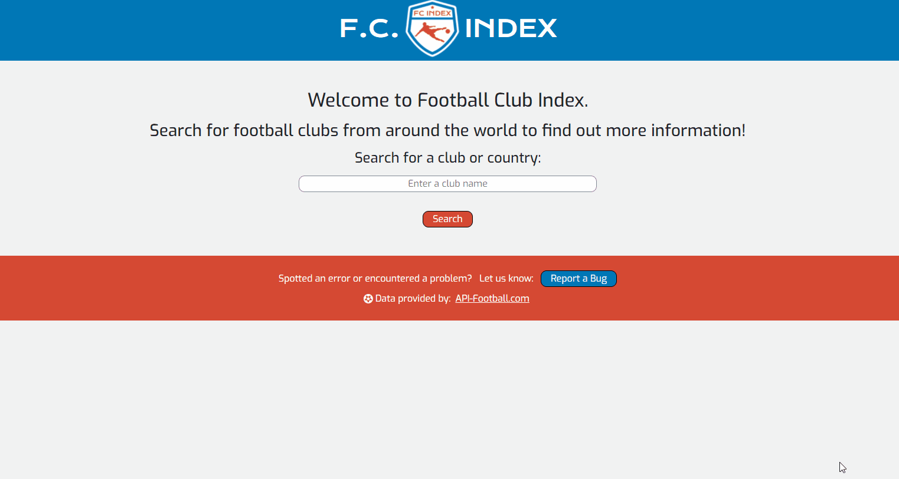
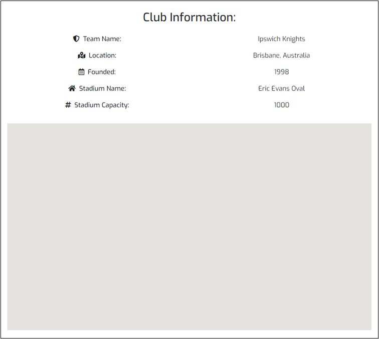
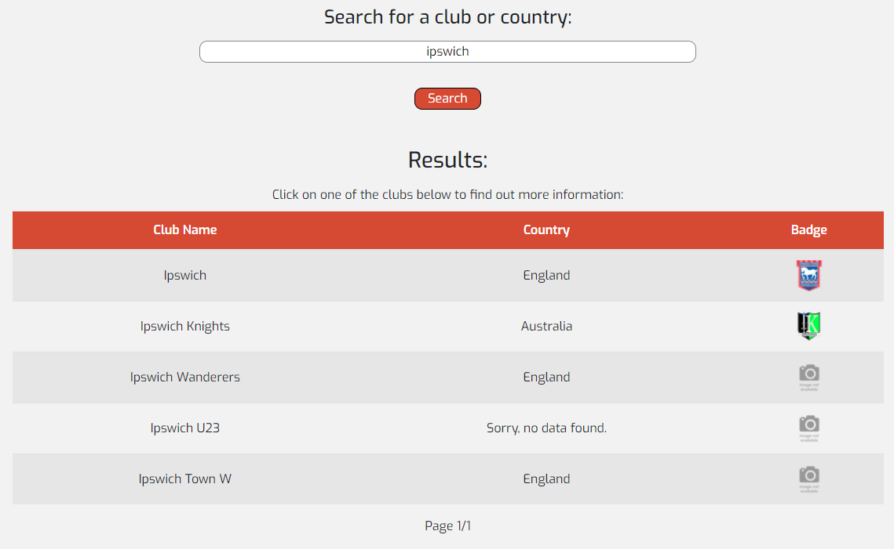
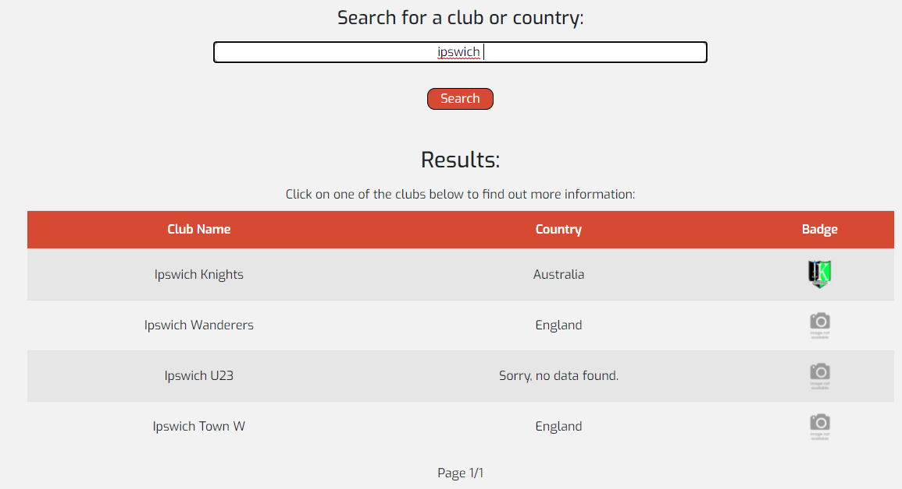
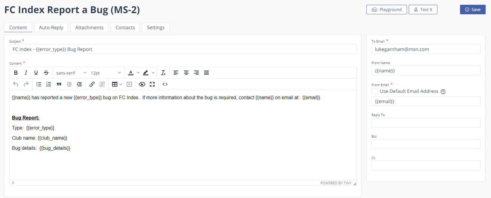

***

# F.C. Index

My project is aimed at football fans; primarily those that are trying to learn more about clubs or those who may be travelling and interested to know if there are any football teams in their place of travel.  FC Index allows users to search for clubs from all over the world and find out information about them as well as see where they are located on Google maps.

The website only has one page with a simple and clean layout.  There is a search box which allows users to search for any club name, city or country.  The website utilises an API to return results of the search string.  Users can then select a club from the selection of clubs returned by the API to find out more information.  The API then provides some high level information on the club which is displayed to the user.  Utilising an API ensures that the data should be maintained and kept up to date.

If the football API returns the club stadium or club city and country, using the Google Maps API utilising the Places API feature, the website searches for the location of the clubs stadium.  If no stadium name is provided, the clubs city is searched for.  If the Places API returns a search result, the location of the club is displayed on a Map.

I have included a form which allows users to report a bug.  Bugs can be related to the use of the website or incorrect club data.

The website is built using HTML, CSS, Bootstrap and JavaScript.  The website can be found [here](https://lukegarnham.github.io/FC-Index-MS2/).

 ***

## UX
 
I used [Coolors](https://coolors.co/) to generate some color schemes and settled on the orange and blue palette.  The logo was designed using [designevo.com](https://www.designevo.com/logo-maker/) and utilises the same colour palette.  I utilise shadow effects when hovering over buttons to give them some depth and interactivity as well.

The purpose of this site is to allow users to search for football clubs.  The search field and button are front and center with little else on the page to distract from that, in a similar way to the [Google](https://www.google.com/) homepage.

### User Stories

The website is for football fans wanting to find out more information on clubs, possibly if they are travelling to a new destination.  As a user:
- I want to search for football clubs and find out more information about them.
- I want to search a travel destination and want to know if there are any football clubs in the city and/or country I am visiting.
- I want the information I am provided with to be up to date.
- I want a way to report any incorrect information I see so that it can be corrected.

As the owner of the website:
- I want users to be able to quickly search for football clubs and find out information about them.
- I want to utilise an API to provide up to date information to my users.
- I want to utilise an API to provide a map showing the clubs location.
- I want users to be able to notify me if any of the information the website displays is incorrect so that it can be fixed.

### Wireframes

[Click here to see my full Wireframe](wireframe/ms2-project-wireframe.pdf)

***

## Features
 
### Existing Features

- [Football API](https://www.api-football.com/):  The API allows for clubs to be searched.  It requires a string of at least 3 characters and returns an array of results.  Each result contains some high level information about the club.  This is the basis of my website - the user enters a string and when they click the Search button or press Enter, the API is called.  The club name, country and badge are displayed in the results section.  They can then click on a club to view the high level information and view their location on a map.  Users can search for a country and any clubs in that country are also returned by the API.  The footballAPI.js file contains the JavaScript functions which call and unpack the data in the API.  The user receives a warning on screen if the string they are searching for is less than 3 characters as this is the minimum string length required by the API.
- Pagination:  Occasionally a large amount of data can be returned by the API.  When a user searches for a club or city, the API will return any clubs which contains that string.  Most of the time the API will only return a handful of results.  However, if a user searches for a country, dozens of results are returned.  It would slow the response time if all of these needed to be output onto the screen so I added a pagination feature whereby a maximum of 10 results are displayed on screen at any given time.  If there are more results to cycle through, Next and Previous buttons are displayed as appropriate.   Text appears between the buttons showing the user how many pages of results there are and which page they are currently on - this feature was an addition late on in the project to improve user experience.  The Next and Previous button event listeners are in the events.js file while the function that populates the page with the next batch of results (resultsOutput) is located in the footballAPI.js file.
- [Google Maps Javascript API](https://developers.google.com/maps/documentation/javascript/overview?_ga=2.246367876.1606386993.1604865013-774398906.1604748970) & [Google Places API](https://developers.google.com/places/web-service/overview):  I have utilized the Google Maps API and enabled the Places API.  The places API allows for strings to be searched for and the results to be displayed on the map with markers.  The JavaScript functions which call the map and markers are in the maps.js file.  I have restricted use of the Google Maps & Places API's through the Google Cloud Platform by limiting which websites the API should accept requests from.  There are currently only two; one is for the GitPod preview environment and one is for the deployed site on GitHub pages.  Although my website only has one page, the wildcard (*) at the end of the URL's is needed since when the user clicks the link in the header, the URL address is apended with "index.html" - without this wildcard (*) the Google Maps and Places API would not work after the user clicks the link in the header.

- Feedback Form:  The website features a form which can be launched using a button in the footer.  The form allows users to report errors with either the website or club data.  The form launches as a modal over the top of the main website so that users do not lose the information they are looking at by having to navigate to another page.  If the form is submitted successully, the modal content changes to thank the user and an OK button enables them to return to the main webpage - the form fields are reset.  If the form is not submitted successfully, the modal content informs them and clicking an OK button returns the user to the form with the data they tried to submit still visible.
- [EmailJS API](https://www.emailjs.com/):  When the form is submitted, an email template is populated and sent to my personal email address.  This is done using emailJS.  The function which calls emailJS is in the emailJS.js file.

Below is as example of the website.  You can see:
1. the warning message the user receives when the search string is less than 3 characters.
2. the warning message the user receives when the search string contains a non-alphanumeric character.
3. the list of results including pagination buttons.
4. the club information that is displayed to users including a map with marker.
5. the Back to Search Results button.
6. the New Search button.
7. the message a user receives if there are no results.

Below is an example of a successful form submission, the message the user sees and the email sent by emailJS:

Below is an example of an unsuccessful form submission and the message the user sees:

### Features Left to Implement

One of the big limitations I came up against as I was developing my project is that the football API only allows 100 calls/day before overage charges are incurred.  Each search on my website performs one call to the API.  The club information returned by the API is fairly high level.  When the user clicks on a club, I use the high level information that has already been returned in the call triggered by the search.  If I wanted to include more information about the club, more calls would need to be made to the API.  When a user clicks on a club, I know the id that the API associates with the club the user is interested in so I could use this to query the API for a lot more data.

If the free call limit was higher, there are many more features I could have added to my project.  The API has a wide range of data available including club stats, player stats, results, fixtures, betting odds and even predictions on who will win fixtures.  If I could make more free calls to the API, I would have made a call to the API to return the competitions (leagues and cups) each club participates in.  I would also have added the recent results of a club and their upcoming fixtures in the club information section.  The latter would be particularly useful to users who are travelling to a destination as they could search for a club in their destination and then be able to check if there is a fixture taking place during their visit.

A future implementation would be to allow users to search by location and see the results on a map rather than as a list.  I would make the results output optional so that a user can choose to see results as a list or on a map.  For example, if a users searches for a country, seeing the results on a map with markers showing the location of each club returned by the API may be more beneficial.  This would also help users visually see which clubs might be closest to where they are staying during their visit.  However, if a user searches for Ipswich, the result returns a club in England and another club in Australia, so seeing these results on a map would not be as useful since nearly the whole world would be visible in order to show all of the result markers at the same time.

The API searches for club names rather than location so if a user searches for London, clubs based in London (Chelsea for example) will not be returned by the API.  Another future development might be to use the Google Maps Places API to first search for football clubs in a location e.g. football clubs in London.  The results returned by the Google Maps Places API could potentially be used to search the football API for more information about that club.

***

## Technologies Used

I used the following languages, frameworks and libraries to build this website:
- [HTML5](https://en.wikipedia.org/wiki/HTML5) - HTML5 has been used to code the content of the website.
- [CSS3](https://en.wikipedia.org/wiki/Cascading_Style_Sheets) - CSS3 has been used to style the content.
- [Javascript](https://en.wikipedia.org/wiki/JavaScript) - JavaScript has been used to add interactivity to the site through calling API's and utilising the data returned by them.
- [Bootstrap](https://getbootstrap.com/) - Bootstrap was used to quickly build the website, place content where desired and add margins and padding.
- [FontAwesome](https://fontawesome.com/) - FontAwesome was used to insert icons into the webpage.  One appears in the Footer and others appear in the Club Info section.
- [Google Fonts](https://fonts.google.com/) - Google Fonts have been used to style the text in the website.  The title in the Header has Krona One font which matches the font used in the logo.  All other content has Exo font.
- [FavIcon](https://www.favicon-generator.org/) - This webpage was used to create the small favicon which appears in the webpage tab.  I used the football club logo which appears in the header.

***

## Testing

Below are a number of the tests that I performed on my website:
1.  I have run all of my code through validation tools to ensure there are no errors.  The HTML has been validated through [this tool](https://validator.w3.org/), the CSS through [this website](https://jigsaw.w3.org/css-validator/) and the JavaScript through [JSHint](https://jshint.com/).
2.  During testing, I noticed that there were some clubs which did not show a result on the map in the club info section e.g. Eric Evans Oval Stadium, Brisbane, Australia for club Ipswich Knights - see below.  The reason was that the createMap function contains an if statement which checks for the results from the Google Maps Places API and then centres the map around the first result (result[0]) and calls the createMarker function to create a marker there.  However, if no results are returned, result[0] doesn't exist and the map has nothing to centre around and nowhere to place a marker.  The reason for this was because there was no if else defined in the createMap function.  I resovled this so that the map is now hidden if there is no result returned by the Places API.

3.  I have tried inputting various strings into the search field to test that it handles anything a user may inadvertantly search for.  Any strings that are less than 3 characters long do not even call the API due to the first if statement in the clubSearch function.  The keyup event listener in the events.js file ensures that users are told that the string must be at least 3 characters long.  I tried inputting strings containing non-alphabetic characters such as numbers and punctuation characters.  In most cases, the API handles the non-alphanumeric character and simply does not return any results.  The second if statement in the clubSearch function ensures that when no results are returned, the user is informed and asked to try changing their search string.  However, when a percentage symbol (%) was included in the search string, the API didn't handle this and resulted in a console log error.  In order to handle this, I decided to limit only alphanumeric characters being passed to the API.  I utilised a solution I found [here](https://stackoverflow.com/questions/4434076/best-way-to-alphanumeric-check-in-javascript).  When the user enters a non-alphanumeric character into the search field, a message warns them that "Your search string must only contain letters or numbers.".  Spaces are still allowed in the search string e.g. "Real Madrid" is allowed.The clubSearch function checks for alphanumeric characters in the search string and if there are any, the API is not called.  I also tried searching for an HTML string and JavaScript string and the result is the same.  Only search strings 3 characters or longer  containing only alphanumeric characters result in the API being called and when it is, the website handles scenarios when the API returns no results.
4.  As I was testing various user inputs I noticed another bug.  When users search for a club, they may accidentally include a trailing space on the end of their search string.  When this happens, the API doesn't return the same results as when the trailing space is not included.  Below is an example of what happens when a user searches for "ipswich" and then what happens when they include a trailing space "ipswich ".  As you can see in the pictures below, the club "Ipswich" is not returned by the API when the user accidentally includes a trailing space in their search string.  To resolve this, I created the searchStringCheck function in the dataValidation.js file.  The users search string is passed to this function and any trailing spaces are removed with the resulting string then being passed to the clubSearch function which then calls the API.  This fixed the above issue so that the same results are returned regardless of whether a user searches for "ipswich" or "ipswich ".  I was careful to ensure that spaces intentionally included by the user to separate two words are not removed.  I utilised a solution found [here](https://stackoverflow.com/questions/37864460/javascript-remove-trailing-spaces-only) to remove the trailing spaces:

5. I tried searching for a country (England).  This returns a large number of results from the API, however there is no noticeable speed difference in the time the API takes to return a dozen results or hundreds of results.  Employing pagination ensures that the webpage only needs to build results for at most ten clubs at a time.  This ensures the results are displayed quickly and there is no delay even when the API returns a large number of results.
6. I tested what would happen if a user double clicks on the search button.  Each click calls the API so the result of the user double-clicking the search button is that two calls are made to the API.  However, this has no impact on what the user sees on screen and the search results are still output to screen as expected.
7.  There are only two links on my webpage.  One appears in the footer and links to the [Football API website](https://www.api-football.com/).  I have tested this and the link opens the webpage in a new window.  The other is in the header and it links to the index.html page so clicking this serves to refresh the page.  Clicking this apends the URL with "index.html".  When I did this, I received a console log from the Google Maps & Pleases API due to the restrictions I had set up.  Initially I only gave the base URL ("https://lukegarnham.github.io/FC-Index-MS2/") permission to access the API which meant that clicking the link in the header apended the URL and caused access to the API to be blocked.  This was a simple bug to fix as I simply added a wildcard (*) to the end of the URL in the permission setting under Credentials in the Google Cloud Platform dashboard.
8.  I performed several tests on the Report a Bug form:
    1. The form opens when the Report a Bug button in the footer is clicked on both desktop and mobile devices.
    2. Users are prevented from submitting the form without any information since all fields are marked as required - this is indicated using red asterix's after each label and also within the placeholder text:
        - As the owner of the website I want to engage with my users when they engage with me.  So when a user reports a bug, I want their details so I can discuss the bug and/or thank them for reporting it and notify them once it is fixed.  Therefore I want to know the users name.  So the first field in my form asks the user to provide their name and it is a required field.  If this is left blank when the user tries to submit the form (by clicking the Report Bug button) a warning asks the user to "Please fill in this field.".
        - As the owner of the website, I want a method to communicate back to users who have reported a bug.  So the next form field asks the user to provide their email address and it is also a required field.  If the Email field is left blank when the user tries to submit the form, a warning asks the user to "Please fill in this field."
        - As the owner of the website, I want to understand as much about the bug that is being reported as possible - this will help me identify and fix the bug quicker.  The next field asks the user to select the type of error they are reporting.  I have provided two options; Club Data Error and Webpage Error.  Since my website relies on data from an external source (the football API), there is a possibility this data is not 100% accurate.  As a user, if I spot that some club data is not up to date, I want a way to report this and notify the owner of the website.  The Club Data Error can be selected in the form to fulfil this purpose.  The Webpage Error option is to enable users to report issues with the website functionality.  This dropdown option is a required field.  If, when the user tries to submit the form, an Error Type is not selected from the dropdown list in the form (i.e. it is left with the default option "Please select"), the user receives a warning asking them to "Please select an item in the list." and the form is not submitted.
        - As a user, if I spot incorrect or out of date information about a club, I want to inform the website owner and tell them which club is effected.  The Club Data Error option in the previous field allows the user to do this.  The next field, Club Name, is hidden by default and only appears if the user selects Club Data Error.  This field allows the user to provide the name of the club that contains incorrect/outdated information.  If the user selects a Club Data Error, then they must provide an entry into the Club Name field.  If the field is left blank when the user tries to submit the form, a warning asks the user to "Please fill in this field.".  Making this field required actually created a bug - when the user selects Webpage Error the Club Name field is intentionally hidden.  However, because the Club Name field is a required field, the user was prevented from submitting the form even when all 4 visible form fields had been populated.  To resolve this, I haven't set the Club Name field as required in the HTML code but I instead add this attriute using JavaScript.  There is an event listener function on the Error Type field which hides or unhides the Club Name field.  I added two extra lines of code to this event listener to resolve this bug; when Club Data Error is selected as the Error Type, the Club Name field is unhidden and the required attribute is set to true.  Conversely when the Error Type field is changed and Club Data Error is not selected, the Club Name field is hidden and the required attribute is set to false.  Finally, the clubName function handles occasions when the Club Name field is empty (e.g. when the user reports a Webpage Error).  This function simply takes the empty input and returns "Not applicable".  This means the owner of the site doesn't receive a blank data field in the bug report.
        - As the owner of the site, a bug report is not much use if there is no detail provided.  Equally, as a user I want to be able to provide a lot of detail about the bug I am reporting to the site owner as possible.  The final field in the form is a text input field and is a required field.  The user can write as much as they wish to detail the bug they are reporting.  If the user tries to submit the form without filling in some information in the final field, they receive a warning asking them to "Please fill in this field.".
        The below demonstrate the results when a user tries to enter a form with an empty field.  Each field is left blank in turn and tested.  I have demonstrated the results for both a Club Data Error and Webpage Error:
        
        
    3. I conducted several tests on the Email field in the form to see which inputs are accepted and which are not:
        - If the user tries to submit the form without providing an @ symbol in the Email field, the form identifies that it is not a valid email address so provides the user with a warning "Please include an '@' in the email address." and the form is not submitted.
        - If the user tries to submit the form without providing any text before or after the @ symbol in the Email field, the form won't be submitted and the user receives a warning message "Please enter a part followed by '@'." or "Please enter a part following '@'."
        - If the Email field contains text, an '@' symbol and more text, the form does get submitted successfully.  This means that "test@fake-email" will be accepted and the form will be submitted despite the domain name of the email address not having a suffix such as .com or .co.uk.
        - However, if the user enters "test@fake-email." into the Email field, the user receives a warning message "'.' is used at a wrong position in 'fake-email.' and the form is not submitted.
        - If the user tries to submit the form with an invalid character (such as '[') in the username (before the '@' symbol) within the Email field, the user receives a warning message "A part followed by '@' should not contain the symbol '['." and the form is not submitted.
        - If the user tries to submit the form with an invalid character (such as '#') in the domain name (after the '@' symbol) within the Email field, the user receives a warning message "A part following '@' should not contain the symbol '#'." and the form is not submitted.
    4. By default, the Club Name field is hidden in the form.  This field becomes visible if the user selects "Club data error" in the error type field.  The Club Name field is correctly hidden again if the user selects "Webpage error".
    5. Once all of the required fields have been populated with valid data, the form can be submitted by clicking the Report Bug button.  There is a delay of a few seconds before the user receives a message thanking them for submitting a bug report.
9.  Whilst testing the form, I noticed that there is a short delay when the user clicks the Report Bug button to submit the form and the success message being displayed.  This delay is caused by the API collating the data to be sent.  Having the form modal visible after the user has clicked to submit the form may lead them to think that their action hasn't done anything and they could try to click the Report Bug button again.  The delay is demonstrated in the first gif below.  I tweaked the code in the emailJS.js file so that a loading gif is displayed so the user knows that the form has been submitted and something is happening.  The loading gif disappears and the user receives either the success of failure modal message.  I created the loading gif using [loading.io](https://loading.io/) using the same colour scheme which runs throughout my website.  The second gif below shows the process after I made this change.  I believe this change will improve the user experience:

10.  I have opened my website on a laptop using Google Chrome, an Android mobile and an iPhone.  The website functions well on all devices and fits the various screen sizes well.  I noticed that on Android, the map can be opened in full screen which improves user experience however this functionality isn't enabled on iPhone.
11.  I used the Lighthouse tool in the Chrome Inspect tools to test the performance of my website.  I ran the tool before and after making the changes detailed below - [here is the report](assets/lighthouse-test-before.pdf) before I made any changes.  These are the observations and changes I made having run the Lighthouse tool the first time:
        1.  Performance:  The Lighthouse report the logos in my website had no explicit height or width.  In my CSS, I had applied a maximum-height property to all of the images but in fact, this could be changed simply to a height property - I made this change to the "header img" rule and ".small-img" class rule.  However, although the CSS rule has been tidied up by making this change, the Lighthouse report still suggessts a width property should be applied.  I am happy that the images will maintain their aspect ratio and thus explicitly defining the height but not the width is not an issue for my project.
        2. Accessibility:  The Lighthouse report suggests that the background and foregrond colours of my footer and search button do not have enough contrast.  I have looked at these sections on my desktop and mobile device and I am comfortable/happy that there is sufficient contrast for the text to be easily read by users.  Therefore, I decided not to make any changes.
        3. Best Practices:  The Lighthouse report highlighted a lack of best practice when linking to an external webpage.  [This webpage](https://web.dev/external-anchors-use-rel-noopener/?utm_source=lighthouse&utm_medium=devtools) explains the problem my site could be exposed to and solutions to negate this risk.  I subsequently added "rel="noopener"" code to the anchor tag in my footer.
        4. SEO:  The Lighthouse report advised the document does not have a meta description which meant the SEO (search engie optimisation) score could be improved.  Details can be found [here](https://web.dev/meta-description/?utm_source=lighthouse&utm_medium=devtools).  I subsequently added a meta description to the head element in my HTML.

[Here is the report](assets/lighthouse-test-after.pdf) after I made the above changes.  The Best Practices and SEO scores have improved as a result of the above changes.

### Development Obstacles

Below are some of the hurdles I came up against whilst developing my project.

1. When the search results are output, I unpack some of the club information into a table.  Each row of the table represents a result from the API from the users search.  In order to populate the club-info section with the correct information, I wanted to create a click event listener to each table row which called a function to populate the club-info section and pass the correct club in as a parameter.  I initally created a simple event listener function for the table rows and passed through the index i representing the position in the array of each club.  This didn't work because each event listener returned the club information for the final club in the results array.  The reason being is that i is incremented in the for loop as the table rows are created thus when the event listener on the table rows was triggered, i represented the final result in the results array.  To overcome this, I turned to Google and eventually found [this solution](http://www.howtocreate.co.uk/referencedvariables.html).  The site offers 3 solutions but rates the final one as the "most complete" which is the one I utilised.  I copied the code and modified it in my footballAPI.js (rows 133-150) file to achieve the desired result.
2. The table of search results has a hover effect to highlight each row blue.  I targetted table rows with my CSS hover rule.  Since the table utilises a Bootstrap class table-striped, alternate rows (the odd numbered rows) have shading inherited from this class and this meant that initially, my css hover effect was only applied to the table rows without any Bootstrap shading (the even numbered rows).  To overcome this, I initially used the !important override in my CSS rule as an easy solution.  Knowing that this is bad practice, I instead used the Chrome Inspect tools to identify the Bootstrap rule which was being applied (.table-striped tbody tr:nth-of-type(odd)) and changed my rule to target the elements with the same level of specificity (.table-striped tbody tr:hover) knowing that my CSS link is placed after the Bootstrap link in my <head> element and would thus 'win' and apply my hover rule to all table rows.
3. I wanted to add pagination to my search results in order to limit the amount of data displayed on screen.  If a user searches for a country, hundreds of results can be returned.  Not only does this slow the website down because it takes a while to unpack so much data, it also elongates the page and does not create a good user experience.  The results from this API have built in pagination but each page contains 100 results.  I wanted to achieve a far more bitesize number of results and deemed that 10 results are easy to visually digest for a user.  The user does not need to do much scrolling when using a mobile phone.  In order to create pagination for 10 results at a time, I utilised the local storage memory.  Upon searching for a club, the array that is returned by the API is saved to local storage as “clubs”.  I also have an index number (i) which I set to zero whenever a search is performed and save it in the local storage.  The index number determines where in the array the user is.  The reason I saved it to local storage is so it can be retrieved by independent “next” and “previous” functions which are triggered by buttons and move the index forward or backwards through the array.  The index is reset to zero after each search.  The resultsOutput function is called when a new search is done and when the previous or next buttons are clicked.  This function retrieves the API results array from local storage as well as the index i.  Using i, the data is unpacked from the API using a for loop.  The results are displayed on screen, starting from our position i and going up to the upper limit which will be 10 or less.  The findLimit function is called which determines whether there are a further 10 results in the array; if so i+10 is returned as the upper limit, otherwise the remaining length of the array is returned as the upper limit.  The resultsOutput function then also checks whether there is an array result 10 further on from the current position (i+10) and if so, displays the “next” button on screen.  If there is an array result 10 before our current position (i-10), the “previous” button is displayed on screen.  I also pass the clubs array and position i into the resultsLinks function.  The next and previous pagination buttons both call similar functions.  Each retrieves the value of i from local storage.  The next button function increases i by 10 and the previous button function decreases i by 10 - i is then saved (updated) in local storage.  The resultsOutput function is then called.

### Unresolved Bugs/Issues

The football API returns a directory for the club badge image.  I use this to display the club badge in the search results table, club info section and in the information shown by clicking on the map markers.  This adds some visual elements to the webpage.  However, for many clubs there is no badge image and the image below is returned by the API.  I had hoped that in each instance where no club badge was provided, the same directory would be returned by the API.  If it was, I would have been able to build an 'if' statement into the JavaScript to check all the club badge directory strings returned by the API.  For example, if the directory string returned for a club matches the "image not available" directory string I would then choose not to use the image.  I would either hide the elements containing the club badge or perhaps use a more visually pleasing, colourful placeholder image, for example the FC Index logo.  Unfortunately, the API returns a unique directory for every club, regardless of whether a club badge is available or not.  Due to this, there is no way to check the directory string to identify if there is a club badge or not and so my webpage presents the below image for quite a lot of clubs.  If a user searches for "Manchester" the API returns 13 clubs, 8 of which have no club badge and thus the below image is returned but from 8 different directories.

***

## Deployment

An account was needed with the [Google Cloud Platform](https://console.cloud.google.com/home) in order to utilise the Google Maps & Places API's.  There is a [dashboard](https://console.cloud.google.com/apis/dashboard) where the API's can be accessed.  The API has currently had it's access restricted to just two websites; one is for the GitPod preview environment and one is for the deployed site on GitHub pages.

The websites that the API will grant access to can be modified in the Credentials section on the dashboard.  The restriction can be removed completely which will mean any website with the API key will be able to use the API and this could lead to malicious use and/or overage charges hence why I added these restrictions.  An API key is required; this can be found in the Credentials section on the dashboard also.  The key is included in the script tag in the index.html file (line 241).  In order to keep the API active, card details are required.  The number of calls required before costs are incurred is unlikely to be reached by this website but in order to utilise the API, a payment method must be provided.  If a payment card expires, the API will be blocked and the maps on the website will no longer work.

To access the Football API, I signed up to an account with [RapidAPI](https://rapidapi.com).  As with the Google Cloud Platform, a method of payment must be provided.  If a payment card expires then the API will be blocked.  There is some detailed [documentation](https://rapidapi.com/api-sports/api/api-football) on the RapidAPI website and also on the [Football API website](https://www.api-football.com/documentation) too.  There is a [dashboard](https://rapidapi.com/developer/dashboard) on the RapidAPI website which enables me to track the number of calls and any overage charges that have been incurred.  The API key can be found under the Security section in the dashboard and this is required in the footballAPI.js file (row 12).

When the form is submitted, emailJS sends the data to me via email.  An account with [emailJS](https://www.emailjs.com/) is needed.  Once the account is created, an email template needs to be created in the Email Templates section in the [dashboard](https://dashboard.emailjs.com/).

The name of the template is called in the emailJS.js file which is also where the variables are asigned values.

The project was developed in its entirety using GitPod with every update being pushed to the main branch.  The main branch is hosted on GitHub pages [here](https://lukegarnham.github.io/FC-Index-MS2/).

***

## Credits

### Media
- The only media content used is the club logo which I created using [this website](https://www.designevo.com/logo-maker/).

### Acknowledgements

- For the modal, I utilised a solution provided [here](https://www.w3schools.com/howto/howto_css_modals.asp).  This solution has been modified for the purposes of my website but I predominently used this for the CSS styling to create the shaded background which sits on top of the main webpage content.
- The favicons were generated using [this website](https://www.favicon-generator.org/).
- The football API was sourced through [rapidAPI.com](https://rapidapi.com/api-sports/api/api-football/details) and the documentation for the API can be found [here](https://www.api-football.com/documentation#leagues-parameters).  The initial API call code for the getAPIData function was copied from [here](https://rapidapi.com/api-sports/api/api-football/endpoints) but modified for the purposes of my website.
- [EmailJS](https://www.emailjs.com/) has been used so that reports submitted by users on the website are emailed to my personal email address utilising an email template.
- [Google Maps JavaScript API](https://developers.google.com/maps/documentation/javascript/overview) has been used to provide the maps in the club info section.  In conjunction with this, [Google Maps Places API](https://developers.google.com/places/web-service/overview) has been used so that the club locations can be searched for and markers added to the map at the location of the first result.  The functions which calls the map and places the marker were copied from [here](https://developers.google.com/maps/documentation/javascript/examples/place-search?hl=en_GB#maps_place_search-javascript) but have been modified for the purposes of my website.
- When the search results are generated, I need each to have an onclick event which passes the relevant club information into the club info section.  To create this, I utilised [this solution](http://www.howtocreate.co.uk/referencedvariables.html) I found through a Google search.  This can be found in the resultsLinks function in the footballAPI.js file.
- The error type provided through the emailJS was originally formatted with underscores and was all in lower case.  Although a minor cosmetic tweak, I wanted this to be formatted with spaces instead of underscores and the first letter of each word to be capitalised so that the emails received looked neater/more presentable.  I utilised [this solution](https://masteringjs.io/tutorials/fundamentals/capitalize-first-letter#:~:text=Capitalizing%20the%20first%20letter%20of,the%20string%20slice()%20method.&text=The%20first%20part%20converts%20the,the%20rest%20of%20the%20string) I found via Google which can be found in the dataValidation.js file.
- During testing, I noticed an error whereby searching for a club (e.g. "Ipswich") doesn't return the expected results if the user accidentally includes a trailing space at the end of the string (e.g. "Ipswich ").  I created the searchStringCheck function in the dataValidation.js file which trims any trailing spaces from the users string but this doesn't remove any spaces between words which the user may have intentionally included.  To solve this, I found [this solution](https://stackoverflow.com/questions/37864460/javascript-remove-trailing-spaces-only) via Google.
- During testing, I also noticed that the Football API returns a console error when the user enters a percentage symbol (%) in the search field.  I decided to restrict entry so that the users can only enter alphanumeric characters and spaces into the search field.  To limit the input to only alphanumeric characters in the search string, I utilised a solution I found [here](https://stackoverflow.com/questions/4434076/best-way-to-alphanumeric-check-in-javascript) via Google.
- When the form is submitted, a gif appears on screen to indicate to users that something is happening e.g. content is being loaded.  The gif I used in this project was created using [loading.io](https://loading.io/).